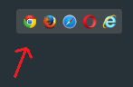

# Programming environment

Welcome to study programming in JavaScript!

JavaScript is a programming language that can be used to produce dynamic, programmatically generated content for web pages.

In the course we use the PyCharm IDE. You can obtain a student license at https://www.jetbrains.com/student/ and then download the [product](https://www.jetbrains.com/pycharm/) (or [Toolbox](https://www.jetbrains.com/toolbox-app/).)

To get started writing programs, follow these steps:

1. To create a new empty project you need to create a folder for your course files. Name the folder the way you want. Then open that folder (never open individual files). Make this folder also to be your Git repository.
2. Add a new directory for each module when you are doing the assignments. 
### Setting code style
1. Set the code style so that the automatic code formatting works as desired
    1. Open File / Settings (win) or PyCharm / Settings (mac)
    2. Select Languages & Frameworks / JavaScript on the left and check that ECMAScript 6+ is selected.
    3. Select Editor / Code Style on the left. Clicking on the CodeStyle triangle opens a list of languages. Select JavaScript
    4. On the right is the link 'Set from'. Select 'Google JavaScript Style Guide.' Now you can format the code automatically with _alt-ctrl-l_ or _alt-cmd-l_
    5. Open File / New Project Setup / Settings for New Projects for new projects and redo steps iii and iv so that all new projects have the same settings.
2. Add an HTML file to the project with the name you want, say `example.html`.
3. Set the program code below to the contents of the file. The actual JavaScript code here consists of a single `console.log()` statement that prints the text `Hello, world!`.
   You can replace it with the program of your choice.

    ```html
    <!DOCTYPE html>
    <html lang="en">
    <head>
        <meta charset="UTF-8">
        <title>JavaScript testing</title>
    </head>
    <body>
        <script>
            'use strict';
            
            console.log('I have awaken!');
    
        </script>
    </body>
    </html>
    ```

4. Use the Ctrl-S key combination to save the file.
5. Press the button on the floating browser bar on the right side of the working area (see picture). The page will open and the JavaScript code will be executed in the browser of your choice. These instructions use the Chrome browser.

    

6. When the Chrome browser opens, press F12 or alt-ctrl-i or alt-cmd-i to open the developer panel in your browser. In the Developer Panel, you can see the console prints produced by the program (such as `I have awaken`) and view any error messages that the program may generate. See picture below.
    

As described here, you can learn the basics of JavaScript programming.
Later, we look at ways in which JavaScript can be used to respond to user input on a web page and to update HTML elements on a web page using either user input or information retrieved from external data sources.
