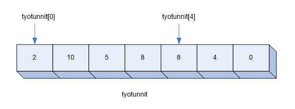
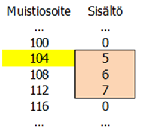

# [Arrays](https://developer.mozilla.org/en-US/docs/Web/JavaScript/Reference/Global_Objects/Array)
An array is a data structure that consists of a set of elements.
The use of an array does not require the invention of a large number of variable names, but all the values in the array - that is, the elements of the array - can be accessed through a single variable.

For example, the following arrays could be created:
- a seven-item integer array showing a person's hours worked each day of the week.
- a four-item string array containing the names of four players.
- A 500-item floating-point array containing five hundred valued random numbers.

For example, the worksheet could be visualized as follows:


Array's elements are referenced by the name and index of the array variable.

In the example, `working hours` is the name of the array variable, and the numbers 0 and 4 are indices.
The indices may vary between 0..6 in the example.

Array's working hours for the fifth item are referred to as "working hours [4]". Numbering starts at zero, and the array's index is always as small as the array's size — that is, the number of items in the array.

JavaScript does not require that all items in a array be of the same type. Thus, for example, a array could be created in which some of the elements are integers and some are strings. However, this is rarely appropriate.

## Defining a array variable and creating a array

Deploying a array consists of defining a array variable and creating a array.

The following statement creates a array variable called numbers, whose value is initially an empty array.
```javascript
        const numbers = [];
```

Then add three items to the array:
```javascript
        numbers[0] = 17;
        numbers[1] = 2;
        numbers[2] = 8;
```        
Alternatively, the array could be created by writing its contents directly to the statement in which the array variable is defined:
```javascript
        numbers = [17,2,8];
```    

Note that you do not need to know the size of the array when creating the array.
Once created, the desired number of items can be added to the array.

The size of the array is determined by the largest index used. The size is one larger than the largest index.
The size of the `numbers` array is obtained from the` numbers.length` expression, if necessary.

## Looping an array

You can loop an array by using for statement and [array.length](https://developer.mozilla.org/en-US/docs/Web/JavaScript/Reference/Global_Objects/Array/length)

```javascript
    const names = ['Frank', 'Scott', 'Jasmine', 'Don'];

    for (let i = 0; i < names.length; i++) {
        console.log(`Name: ${names[i]}`);
    }
```

Example output:
```
Name: Frank
Name: Scott
Name: Jasmine
Name: Don
```

You can also use [for...of statement](https://developer.mozilla.org/en-US/docs/Web/JavaScript/Reference/Statements/for...of) to do the loop:

```javascript
    const names = ['Frank', 'Scott', 'Jasmine', 'Don'];

    for (let name of names) {
      console.log(`Name: ${name}`);
    }
```

## Array methods

Pre-programmed methods can be applied to the array to modify it.
Examples of these methods are:
- `sort()` sorts the array alphabetically
- `reverse()` reverses the items in the array in reverse order
- `shift()` deletes and returns the 1st item in the array
- `pop()` deletes and returns the last item in the array
- `push(value)` adds the value at the end of the array, multiple values separated by commas
- `includes(value)` checks whether the array contains the given value

Prefer [array.push(value)](https://www.freecodecamp.org/news/javascript-append-to-array-a-js-guide-to-the-push-method-2/) over `array[] = value` for convenience when adding values to an array.

Methods are called by first writing the name of the array variable, then point, and finally the name of the method.
For example, a array called `numbers` is sorted by typing `numbers.sort()`.
Note that the `sort()` method mentioned above sorts the array in alphabetical order and not in numerical order. In this case, for example, the values 100, 23 and 15 would be sorted in alphabetical order 100, 15, 23, which is usually not the order desired by the programmer. This can be fixed by typing the desired sort function in the `sort ()` method call. For example, the array `numbers` would be sorted in numerical order as follows:
```javascript
numbers.sort((a,b) => a-b);
```
Above example uses so-called arrow function to write the sorting function; arrow functions will be explained later.

### Object literals

Object Literal defines statically declared data structure. Object literal is simply a comma-separated list of name value pairs inside curly braces. These 'names' are called properties. Object literal can be used similarly as e.g. a dictionary in Python. Typical object literal looks like this:
```javascript
const student = {
  firstName: 'Greg',
  lastName: 'Focker',
  studentId: '234359',
  phone: '040 5902123',
}
```

Properties can be referred to by alternative notations. For example, a student's first name is given by `student.firstName` or `student["firstName"] `.
```javascript
const greeting = `Hello, my name is ${student.firstName} ${student.lastName}`;
const studentInfo = `student number: ${student['studentId']}, phone number: ${student['phone']}`
```

Object literals are dynamic, so you can add and remove properties at any point (even if you use const). This is called mutating the object.
```javascript
student.address = 'Schoolroad 7';  // adds 'address' property to previous example
delete student.phone;              // deletes 'phone' propertt from previous example
console.log(student);
```

The property key can also be stored in a variable. The following code prints the student's last name:

```javascript
const chosenProperty = "lastName";
console.log(student[chosenProperty]);
``` 

The definition of an object literal can also contain functions. The example below creates an object for which the remaining number of credits required for the degree is calculated using a function. Finally, that credit is printed.

```javascript
let student2 = {
      firstName: 'Ahmed',
      lastName: 'Hussein',
      credits :175,
      hasLeft: function() {return 240-this.credits}
    }

console.log("Student " + student2.firstName + " is missing " + student2.hasLeft() + " credits.");
```

Functions are discussed in detail below.

The above object literals were used as a data structure in which several related values can be stored "behind" a single variable name.
Although object features are not covered here, JavaScript is a full-blooded object-oriented programming language that allows you to define classes with their constructors and methods. Objects can be created with the `new` statement, and classes can be defined as subclasses of other classes from the ES6 language version in much the same way as in the Java programming language.

# Functions

A function is a part of a program that makes a limited set of actions.
The idea behind the functions is modularity: since the same thing should not be done many times, it is a good idea to write the general-purpose parts of the program as functions that can be used several times within the program.

The already programmed function can then be thought of as a “black box”. It can be used whenever you need it - once it has been carefully programmed and tested.

The function is called (i.e. used) from the main program, i.e. the part of the program outside the functions. Functions can also call each other.
A button embedded in a web page can also launch a function.

JavaScript supports two ways of writing functions:
- Functions written as `function` statements
- arrow functions.

The former represents the well-established way of writing functions in procedural programming languages.
The arrow functions, in turn, represent a new functional programming paradigm in which stateless and side-effectless functions are written.

The functional programming paradigm is considered more difficult to learn, and the JavaScript code generated using the arrow functions is more concise and, at least initially, more challenging for the developer to understand and produce.

For this reason, the main focus of this page is on functions written with the `function` statement. At the end of the page, however, you also take a look at creating arrow functions.

## Parameterless and returnless function

Let us first consider an example of a function without a parameter and without return.
Such a function does the same thing every time it is called: its functionality cannot be controlled from outside the function, and the function does not return any data to the part of the program calling it.

The following function prints a constant greeting text:

```javascript
        function greet() {
            console.log('Well, hello!');
            return;
        }
```     

The function ends with a `return` statement. The `return` statement is also used to return a return value, but in this case there is no return value.

The function written above is not executed on the basis that it is written in a program, but the function must be called separately from outside it.

Below the function definition, add the main program that contains the function call:

```javascript
        greet();
```

Now the function is executed and the program prints the greeting text.

Using a function improves modularity: if you need to change the way you greet later in the program, it is enough to make the change in one place: in the function definition.

## Parametric function

The greeting function described above is extended so that the programmer can specify the greeting text and the number of greetings. This is called parameterizing a function: in this case, two parameter variables (`text` and` times`) are defined that tell you exactly how the function is supposed to work:

```javascript
        function greet(text, times) {
            for (let i = 1; i <= times; i++) {
                console.log(text + ' ' + i + '. time!');
            }
            return;
        }
```

Parameter variables get their values when the function is called. The values given in the function call are called function arguments.

When a function is called and execution passes to the function, the values of the arguments in the call are copied to the values of the parameter variables in the function definition.

Write a function call below the function definition:
```javascript
        greet('Hi', 4);
```
The program produces the following output:
```
Hi 1. time!
Hi 2. time!
Hi 3. time!
Hi 4. time!
```
When calling the function, the value of the first argument (the `Hi` String) was copied to the value of the first parameter variable `text`. Similarly, the value `4` of the second argument is copied to the value `times` of the second parameter variable.

The function written in this way is more general than before. It can be used to produce different greetings in different parts of the main program.

## Function with return value

The parameters can be used to give the function the necessary input data from the outside, on the basis of which the function performs its function. Often, the result of that action is a result that must be passed back to the part of the program (the main program or another function) that originally called the function. The result to be returned is called the return value of the function.

For example a program that calculates the quadratic sum of two numbers. The quadratic sum of the numbers 2 and 5 is 2 * 2 + 5 * 5, or 29. The numbers whose quadratic sum is calculated (e.g., 2 and 5) are parameters of the function. Correspondingly, the result of the calculation (e.g. 29) is the return value of the function, i.e. the result which is passed to the part of the program which calls the function.

The return value is returned with the `return` statement. For example, the value of a variable called `result` would be returned with the following statement:
```javascript
        return result;
```

The function in the program below performs the calculation of the quadratic sum. After the function is a main program that calls the `quadratic` function, giving it parameter values. Finally, the main program prints the return value returned by the `quadratic` function.

```javascript
        function quadraticSum(first, second) {
                const result = first * first + second * second;
                return result;
        }
        
        const num1 = prompt('Enter 1. number.');
        const num2 = prompt('Enter 2. number.');
        const quad = quadraticSum(num1, num2);
        console.log('The quadratic sum of ' + num1 + ' and ' + num2 + ' is ' + quad);
```

## Visibility of variables
With the introduction of functions, it is necessary to consider the visibility of variables.

In previous examples, variables defined by the `let` and` const` keywords have been used. They are available (or visible) in the part of the program (code block) where they are defined - as well as in the code blocks inside it. When the word `let` (or `const`) defines a variable in the main program (outside the functions), it becomes a global variable that is available throughout the program.

The global variable can also be defined outside the functions with the `var` statement.

Within a function, the variables defined by the `var` statement are local variables of the function.
The local variable of a function appears everywhere in the function in which it is defined.

Consider an example that illustrates the differences in visibility between the variables defined by the `var` and` const` statements:
```javascript
        const n1 = 3; // global variable

        function hello() {
            var n2 = 5; // an internal variable of a function

            if (n2>0) {
                const n3 = 8; // an internal variable of a block
                var n4 = 9; // an internal variable of a function
            }
            console.log(n1); // global variable is visible everywhere
            console.log(n2); // the internal variable is aviailable inside the function
            //console.log(n3); -- an internal variable of a block is not available outside the function
            console.log(n4); // the internal variable of the function is available inside the function

        }

        hello();

        console.log(n1); // the global variable is visible everywhere
        //console.log(n2); -- the function's internal variable does not appear outside the function
        //console.log(n3); -- the internal variable of a block does not appear outside the block
        //console.log(n4); -- the function's internal variable does not appear outside the function
```

Some print statements have been commented as inoperative; those statements refer to a variable that does not appear in that part of the program.

For example, if the global variable and the local variable of a function had the same name, the local variable would overlap the global variable in the function in which it is defined.
In this case, two different variables with the same name but different visibility would be used.

## Array as a parameter

It was stated above that the values of the arguments of a function are copied to the values of the parameter variables when the function is called. Next, consider a situation in which a parameter array is passed to a function.

In the case of primitive variables, the value of the parameter is the value of the variable (for example, 3). The value of a array variable, on the other hand, is not the array itself but a reference to the array. The reference refers to the memory address where the array is stored in the runtime environment.

The figure below shows the relationship between a memory address and its contents. (The memory addresses in the illustration are examples only. Actual memory addresses are not visible to the programmer and are not relevant to programming.)



When a function is called and an array is passed as a parameter, its memory address is copied. The array itself is not copied to the value of the parameter variable.
Thus, the array variable in the function call and the internal parameter variable in the function refer to one and the same array.
Such a method of transmitting parameters is called pass-by-reference. The programmer should be aware of this so that the handling of arrays as a parameter does not cause surprises.

Consider, for example, the program below, in which the main program creates a three-element array, passes it to a function as a parameter, and finally prints the values in the array.

```javascript
        function grow(array) {
            for (let i = 0; i<array.length; i++) {
              array[i]++;
            }
            return;
        }

        const numbers = [5,6,7];
        grow(numbers);
        console.log(numbers[0] + ' ' + numbers[1] + ' ' + numbers[2]);
```

The program prints:
```
6 7 8
```

What happened?
1. The main program created a three-item array called `numbers`, in which the numbers 5, 6 and 7 were stored. The array is located in one of the memory addresses X.
2. In the call to the `grow()` function, the memory address X is copied to the value of the parameter variable array.
3. The parameter array `array` is used to retrieve the array and all its values are incremented by one. This is the same array created in the main program.
4. The function ends. The contents of the array are retrieved in the main program via the array variable `numbers` and the values in the array are printed.

It is observed that when the array passed by the main program parameter is modified in the `grow()` function, the change to the main program that calls the function is also displayed.

## Array as a return value

You can return a reference to an array as the return value of a function. Let's look at the program below that returns the values of a lottery as an array:

```javascript
function doLottery (numbers, num) {
  const row = [];
  let r;
  for (let i = 0; i < num; i ++) {
    let ok = false;

    while (!ok) {
      ok = true;
      r = Math.floor(Math.random() * numbers) + 1;
      for (let j = 0; j < i + 1; j ++) {
        if (row [j] === r) {
          ok = false;
        }
      }
    }
    row[i] = r;
  }
  return row;
}

const lottery = doLottery(40,7);
for (let i = 0; i < lottery.length; i++) {
    console.log(lottery[i]);
}
```
Note that the lottery number array was created inside the function. The reference to the created array is returned as the return value of the function (the value of the `row` of the function's internal array variable). The lottery row is accessed from outside the function via the array variable `lottery`; its value is the reference to the array obtained as the return value of the function.

## Arrow functions

The examples on this page are written using the traditional `function` statement in JavaScript. The ES6 language specification provides an alternative, more compact way to write a function. Functions according to this notation are called arrow functions, or lambda functions.
(The arrow functions also solve some inconveniences associated with the `this` keyword in the previous ES5 language version, but will not be discussed further here.)

Let's write the quadratic calculating function in the previous exam this time as an arrow function:
```javascript
        const quadraticSum = (a, b) => (a * a + b * b);
```

In this representation, a descending, unnamed function of the quadratic sum seems to be placed as the value of a constant named `quadraticSum`.

The parameters (in this case `a` and` b`) are listed before the arrow operator, and the return value is the quadratic sum of the numbers.

The arrow function is called in the same way as a function written with the `function` keyword.

```javascript
        console.log(quadraticSum(3,5));
```


Let us now consider attaching a block of code to an arrow function.
The version of the `quadraticSum` function below also includes a print statement, so a block of code is needed to write the statement. In this notation, the return value can be passed with the `return` statement.

```javascript
        const quadraticSum = (a,b) =>
        {
            console.log('quadraticSum was called.');
            return (a * a + b * b);
        }
```

Calling a function that contains a block of code is the same to the previous example:
```javascript
        console.log(quadraticSum(3,5));
```

