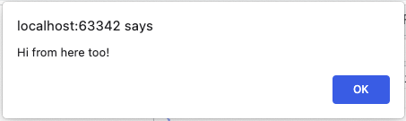
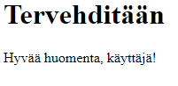
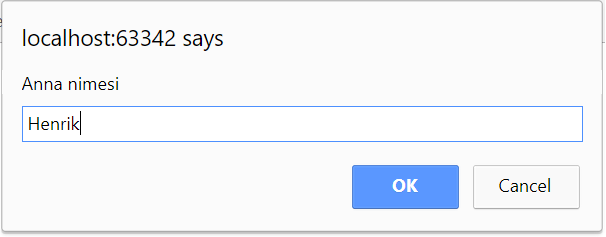

# Interactive programs
In this module, you will learn how to write simple, interactive
JavaScript programs.

Interactivity refers to a model in which a program
1. reads feeds from the user
2. handles feeds
3. prints the result.

An example of this is a program where the user enters two numbers and the program prints
the sum of those numbers. The user gives two inputs: the first and the second number (step 1), the program calculates the
sum (step 2) and the program prints the sum (step 3).

## Adding JavaScript to HTML documents
You can add JavaScript into HTML by using the `<script>` element in two ways: inline or external file:

#### Inline: 
```html
<!DOCTYPE html>
<html>
<head>
    <meta charset="UTF-8">
    <title>Testing JavaScript</title>
</head>
<body>
    <h1>Example</h1>
    <script>
        'use strict';
        console.log('This is text is printed to the console.');
    </script>
</body>
</html>
```

#### External file:
example.js:
```javascript
  'use strict';
  console.log('This is text is printed to the console.');
```
example.html
```html
<!DOCTYPE html>
<html>
<head>
    <meta charset="UTF-8">
    <title>Testing JavaScript</title>
    <script src="example.js" defer></script>
</head>
<body>
    <h1>Example</h1>
</body>
</html>
```

Using external JavaScript files is the preferred method, because it makes maintaining code easier in real life projects. Note the `defer` attrubute in the ´<script>´ element. Defer specifies that the script is downloaded in parallel to parsing the page, and executed after the page has finished parsing. This means that scripts are executed after all the HTML elements of the document are ready. If the HTML elements are not there, obviously JavaScript cannot manipulate them and the app does not work.

Before `defer` attribute existed, the same was achieved by placing the `<script>` elements to the end of the document right before `</body>` closing tag.

## Printing

Let’s start with a simple program that produces a printout for the user.

JavaScript offers three printing options:
1. Console log output
2. Pop-up warning window
3. Printing into a web page

Let's take a look at each printing method here. In the future, the use of the console log print will be used the most because it
is more appropriate for learning programming: printouts are displayed at once, not all
of the warning windows need to be acknowledged separately.

### Console log
The console log is generated using the `console.log ()` method.
The log output is usually displayed on the Console tab in the browser's developer tools.

```javascript
        console.log('Howdy partner!');
```

Output in the console window:

```monospace
Howdy partner!
```

### Pop-up window

A pop-up message window is generated with the [`alert`](BOM-DOM-event.md#alert-metodi)-function:
```javascript
        alert('Hi from here too!');
```

The alert window that appears in the browser looks like this:



### Printing into a web page

A JavaScript program can print HTML content as part of a web page using [dom methods](BOM-DOM-event.md##dom---document-object-model). For example, the following HTML page contains a JavaScript section that programmatically prints the contents of a paragraph element (`<p id="target"></p>`):

```html
<!DOCTYPE html>
<html>
<head>
    <meta charset="UTF-8">
    <title>Testing JavaScript</title>
</head>
<body>
<h1>Greeting</h1>
<p id="target"></p>
<script>
    'use strict';
    const name = 'Frank';
    document.querySelector('#target').innerHTML = 'Good morning, ' + name + '!');
</script>
</body>
</html>
```

The webpage you open looks like this in your browser:



In practice, software outputs are usually collected in their own functions, which are called as a result of some event, for example
pressing a button on a web page. This printing method requires the understandig of function and a document object model concepts, so it will not be discussed further in this context.

From now on, the examples use mostly the console printing option, the `console.log ()` method.

### String literals

Strings printed above such as `Howdy, partner!` are examples of string literals.
A literal refers to a value that is written in the program code as it is, i.e. they are hard coded.
String literals are always enclosed in quotation marks. In JavaScript it is a common practice to use single quotes.

Examples of string literals:
- `'Metropolia'`
- `'A2'`
- `'Here is some text.'`

Of the quotation marks, the JavaScript interpreter recognizes that this is a string literal.
In this case, the interpreter can handle it correctly, for example when asked to print its contents as is.

## Variables
The values required by the program can be stored in variables.
The values stored in the variable can be read many times during the program, and the values set once can be changed.

JavaScript variables are defined by a `const`,` let`, or `var` statement. The choice of a keyword affects the visibility of the variable: whether the variable appears at the code block or function level.
These programming language structures are discussed later; at this point, it is enough to learn how to define variables using the `const` and 'let' keywords.

For example, a variable called `name` is defined as follows:
```javascript
        let name;
```
At this point, the variable is defined, that is, from the program point of view it exists: a value can be set for it and its value can be read.
The value can be set and read any number of times; however, the value of a variable can only be read after the variable has been initialized, ie it has been set to a value for the first time.

The above variable can be initialized as follows:
```javascript
        name = 'Myles';
```


The variable could also be defined and initialized at the same time:
```javascript
        const name = 'Myles';
```

Variables are loosely typed, so when defining a variable, it is not necessary to say what value is to be stored in the variable — whether it is an integer (such as 17), a floating point number (such as 21.38), or a string (such as "computer").

The names of the variables are symbols invented by the programmer himself. Names can contain letters, numbers, and underscores and dollar signs. However, the variable name cannot begin with a numeric character. For example, `number2` and` kilograms` are valid variable names, but `7days` or `super-high` are not. In the names of variables, Scandinavian characters may be used. they are often avoided because there may be problems printing characters when your computer or browser has different country settings.

For example, the following program defines two variables, the first of which stores a string and the second an integer. The program then prints the values of the variables, replaces them with new values, and prints the changed values:
```javascript
        let number, name;
        number = 153;
        name = 'Anna';
        console.log(number);
        console.log(name);
        number = -17;
        name = 'Pekka';
        console.log(number);
        console.log(name);
```

Output produced by the program:
```
153
Anna
-17
Pekka
```   
### Variable types

Two types of variables were discussed above: integers and strings.
There are six primitive types of variables in JavaScript:
- boolean type, which can be `true` or` false`
- a numeric type that can contain an integer or a floating point number.
- string
- `null`, which indicates that the value is empty.
- `undefined`, which indicates that the specified variable has not yet been initialized, in which case its type is unknown.
- symbol to create unambiguous identifiers.

In addition to the elementary types listed above, JavaScript has an object type that can contain objects of arbitrarily complex structure.

The type of the variable can be tested with `typeOf`-operation:
```javascript
        const name = 'Ahmed';
        console.log(typeof name);
 ```
The program prints out "string".
 
### Changing the type

A numeric variable can be converted to a string using the `toString` method:
```javascript
        const age = 23;
        const ageStr = age.toString();
```
The conversion in the other direction can be done with the parseInt or parseFloat method:
```javascript
        const ageStr = '23';
        const moneyStr= '15.48';
        
        const age = parseInt(ageStr);
        const money = parseFloat(moneyStr);
```
The conversion can also be done with the unary `+` operation:
```javascript
        const money = +moneyStr;
```

        
        
### Combining strings
String concatenation is performed with the `+` operation.
For example, the following statement constructs an output of three substrings:
```javascript
        console.log('Good' + ' morning' + ' all.');
```

Printout:
```
Good morning all.
```

Alternatively, the substrings and the concatenated string could be stored in the variables and the value of the variable containing the concatenated string printed:

```javascript
        let first, second, third, all;
        first = 'Good ';
        second = 'morning ';
        third = 'all.';
        all = first + second + third;
        console.log(all);
```       

## Template strings (Template literals)
Template literals are literals delimited with backtick (`) characters, allowing for multi-line strings and for string interpolation with embedded expressions (and for special constructs called tagged templates which is not covered here).
```javascript
const someText = `Here is some multiline text.
Here is the second line`;
```
The formal name of template string is template literal. They are called template strings because they are used most commonly for string interpolation (to create strings by doing substitution of placeholders). Syntax is similar to Pythons f-string:
```javascript
const name = 'Mr. Skywalker';
const greeting = `Hello ${name}`;
```

## Feed reading
In the previous examples, the printouts produced by the programs were always the same, and the user could not influence their content in any way.

Such programs are rare. In general, it is desired that the user be able to provide the program with inputs that affect the course of the program.

The input is read by the [`prompt ()`](BOM-DOM-event.md#prompt-method) function. The argument to the function is given to a string, which is presented to the user in a dialog box.
The following sentence asks the user for this name:

```javascript
     prompt('Type your name.');
```

A dialog box will appear in the browser window:



In that form, however, the question is quite useless, as the name given by the user is not recovered. Thus, feeds read from the user are almost invariably stored in variables so that the read feeds can be used later in the program.

The following example program asks for the user's name and greets him or her in person:

```javascript
     const name = prompt('Type your name.');
     console.log('Noice to meet you, ' + name);
```

## Mathematical operations

Numerical variables can be subjected to mathematical operations: for example, they can be added and subtracted and rounded to the desired accuracy.
Numerical values can also be generated using a random number generator.

### Basic calculations

The basic JavaScript calculations are:
- sumamtion (`+`)
- subtraction (`-`)
- multiplication (`*`)
- division (`/`)
- modulo (`%`)

```javascript
        let number = 3;
        number = number * 7;     // the value is now 21
        number = 1 + number/2;   // the value is now 11.5
        console.log(number);
```
The following operations can be used to change the value of a variable by one:
- add by one (`++`)
- subtract by one (`--`)

```javascript
        let number = 3;
        number++;     // the value is now 4
        number--;     // the value is again 3
        console.log(number);
```


You can also change the value more at once:
- increment by constant (`+ =`)
- reduction by constant (`- =`)
- multiplication by constant (`* =`)
- division by constant (`/ =`)

```javascript
        let number = 3;
        number *= 2;    // the value is now 6
        number /= 3;    // the value is now 2
        number += 7;   // the value is now 9
        number -=8;    // the value is now 1
        console.log(number);
```


### Mathematical functions

Many mathematical operations - such as calculating a cosine or taking the square root - are performed using mathematical methods using the `Math` object. For example, the following program prints the square root of a number 3 (`Math.sqrt`) and a random number (`Math.random`) between zero and one:
```javascript
        console.log(Math.sqrt(3));
        console.log(Math.random());
```

There is no need to memorize the methods provided by the Math object.When you type code in the IDE (for example, WebStorm) and enter the word `Math` after typing a period, the IDE provides a list of available methods and constants. You can also see from the list what arguments must be given for each of the methods; for example, the square root method `sqrt` requires an argument to be rooted, while the random random method does not require arguments,
You can also get acquainted with the available methods through the official JavaScript specification: <http://www.ecma-international.org/ecma-262/6.0/> (Chapter 20.2) or you can use one of the numerous JavaScript sources and teaching materials on the Internet.

## Automatic setting of variables
JavaScript programs run by default in the so-called in sloppy mode, where it is not mandatory to specify variables with the word `let` or `const`. In this case, a global (i.e., program-wide) variable is automatically defined each time the programmer places a value in the variable for the first time.

For example, the following program could run seemingly successfully:
```javascript
        let diameter = 0;
        diametr = 2340;
        console.log('The diameter is : ' + diameter);
```

However, the program prints zero as the diameter; this is due to a typo in the variable name by the programmer.
The program initially creates a variable called `diameter` defined by the` let` statement. However, the second line places the value in a variable with a different name, accidentally misspelled `diametr`. In this case, another variable is automatically created.
Eventually, the program has two different variables, and the program prints a diameter of zero due to the fact that the correct value `2340` was placed in the wrong variable. Instead, the value of the correctly spelled variable defined by the `let` statement had remained at zero.

Situations such as those described create semantic errors that are difficult to find, in which the execution of the program does not crash with an error message, but instead the program malfunctions.

Therefore, the automatic creation of undefined global variables should be prevented. This can be done by adding a `use strict` statement to the beginning of the program, which is written in quotation marks as below:

 ```javascript
         'use strict';
 ```

As a result, the program is executed in strict mode.
In strict mode, an error message is printed whenever an attempt is made to place a value in an undefined variable. The global variable is no longer created automatically, but requires typing a `let` or` const` statement. Using this configuration changes any misspellings that the user accidentally makes that are not noticed to visible syntax errors. This makes it easier to write programs that work properly.

For the reason described above, it is a good idea to use the `use strict` specification in each program.

## Designated Constants

In the previous examples, variables were used that were defined mainly by the `let` statement. The values of the variable, as the name implies, can be changed during program execution.

Sometimes a situation may arise where you want to create a variable to preserve a complex value, but the value of that variable is not intended to change during program execution. An example of such a value is, for example, a conversion factor of 4.1888 between two units of energy, calories and Joules.

To preserve such a constant value, a named constant defined by the word `const` may be used. The value of the designated constant can be set once, but it cannot be changed.

The following program asks the user for two values of calories and converts them to joules:
```javascript
        const multiplier = 4.1868;
        let k1, k2, j1, j2;
        k1 = prompt('Give the amount of energy for lunch (kcal).');
        k2 = prompt('Enter the amount of energy for dinner(kcal).');

        j1 = multiplier * k1;
        j2 = multiplier * k2;

        console.log('At breakfast you got '+j1+' kJ and at dinner you got '+j2+' kJ.');
```

The use of designated constant `multiplier` in strict mode ensures that the correct value is used for both multiplications. If the conversion factors were written to the program code twice, it is possible that a typographical error would have occurred in the decimals of the second factor, which would result in a small but difficult-to-detect calculation error in the final result.

### The use of designated constants in JavaScript vs other languages
Unlike many other languages, JavaScript tends to present almost all variables as named constants. So make it a habit to use the `const` keyword every time you create a new variable. You only need the `let` keyword when the value of a variable needs to be changed later in the program.
